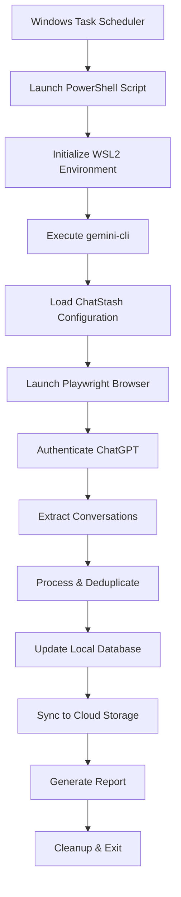

# ChatStash Gemini CLI Runbook

*Detailed automation workflow for gemini-cli execution via Windows Task Scheduler*

## Overview

This runbook defines the complete automation workflow for ChatStash's daily conversation export process. The system uses Windows Task Scheduler to launch gemini-cli within WSL2, executing a sophisticated Playwright-based extraction and synchronization pipeline.

## Workflow Architecture



## Task Scheduler Configuration

### Primary Task Setup

**Task Name**: `ChatStash-DailyExport`
**Trigger**: Daily at 3:00 AM (configurable)
**Action**: Run PowerShell script
**Security Context**: Run with user credentials

### PowerShell Launcher Script

```powershell
# chatStash_launcher.ps1
$ErrorActionPreference = "Stop"
$LogPath = "$env:USERPROFILE\ChatStash\logs\scheduler.log"

try {
    # Ensure WSL2 is available
    wsl --status | Out-Null
    if ($LASTEXITCODE -ne 0) {
        throw "WSL2 not available or not started"
    }
    
    # Set environment variables for WSL2
    $env:CHATSTASH_CONFIG_PATH = "$env:USERPROFILE\ChatStash\config"
    $env:CHATSTASH_DATA_PATH = "$env:USERPROFILE\ChatStash\data"
    
    # Launch gemini-cli in WSL2
    $timestamp = Get-Date -Format "yyyy-MM-dd HH:mm:ss"
    Add-Content -Path $LogPath -Value "[$timestamp] Starting ChatStash export"
    
    wsl --cd /mnt/c/Users/$env:USERNAME/ChatStash gemini-cli run export_workflow.yml
    
    if ($LASTEXITCODE -eq 0) {
        Add-Content -Path $LogPath -Value "[$timestamp] Export completed successfully"
    } else {
        throw "Gemini CLI execution failed with exit code $LASTEXITCODE"
    }
}
catch {
    $timestamp = Get-Date -Format "yyyy-MM-dd HH:mm:ss"
    Add-Content -Path $LogPath -Value "[$timestamp] ERROR: $($_.Exception.Message)"
    
    # Optional: Send email notification on failure
    # Send-MailMessage -To "user@domain.com" -Subject "ChatStash Export Failed" -Body $_.Exception.Message
    
    exit 1
}
```

## Gemini CLI Workflow Configuration

### Primary Workflow: `export_workflow.yml`

```yaml
name: ChatStash Daily Export
description: Automated ChatGPT conversation export and synchronization
version: 1.0

steps:
  - name: environment_check
    description: Verify runtime environment and dependencies
    command: python
    args:
      - scripts/env_check.py
    timeout: 30s
    on_failure: exit
    
  - name: load_configuration
    description: Load and validate ChatStash configuration
    command: python
    args:
      - -c
      - "from src.config import Config; Config.validate()"
    timeout: 10s
    on_failure: exit
    
  - name: initialize_browser
    description: Launch Playwright browser with ChatGPT session
    command: python
    args:
      - src/exporters/browser_manager.py
      - --mode
      - initialize
    timeout: 60s
    retry_count: 3
    retry_delay: 10s
    
  - name: authenticate_chatgpt
    description: Authenticate with ChatGPT using stored credentials
    command: python
    args:
      - src/exporters/chatgpt_auth.py
      - --auto-login
    timeout: 120s
    retry_count: 2
    on_failure: cleanup_and_exit
    
  - name: export_conversations
    description: Extract conversations from the last 24 hours
    command: python
    args:
      - src/exporters/conversation_extractor.py
      - --days
      - "1"
      - --format
      - json
      - --output
      - data/exports/daily
    timeout: 1800s  # 30 minutes for large conversation sets
    
  - name: process_conversations
    description: Deduplicate and process extracted conversations
    command: python
    args:
      - src/sync/conversation_processor.py
      - --input
      - data/exports/daily
      - --deduplicate
    timeout: 300s
    
  - name: update_database
    description: Update local conversation database
    command: python
    args:
      - src/database/db_manager.py
      - --import
      - data/exports/daily/processed
    timeout: 180s
    
  - name: cloud_sync
    description: Synchronize processed data to cloud storage
    command: python
    args:
      - src/sync/cloud_sync.py
      - --upload
      - data/exports/daily/processed
    timeout: 600s
    retry_count: 3
    retry_delay: 30s
    
  - name: generate_report
    description: Generate daily export report
    command: python
    args:
      - scripts/generate_report.py
      - --date
      - "today"
      - --output
      - reports/daily
    timeout: 60s
    
  - name: cleanup
    description: Clean up temporary files and browser sessions
    command: python
    args:
      - scripts/cleanup.py
      - --temp-files
      - --browser-sessions
    timeout: 30s
    always_run: true

error_handling:
  on_step_failure:
    - log_error
    - send_notification
    - cleanup_resources
    
  on_workflow_failure:
    - generate_failure_report
    - send_alert_email
    - preserve_debug_data

notifications:
  email:
    enabled: true
    smtp_server: "${SMTP_SERVER}"
    from: "chatstash@${DOMAIN}"
    to: "${USER_EMAIL}"
    
  success_subject: "ChatStash: Daily export completed successfully"
  failure_subject: "ChatStash: Daily export failed - Action required"

logging:
  level: INFO
  file: logs/gemini_workflow.log
  rotation: daily
  retention: 30d
  
environment:
  required_vars:
    - CHATSTASH_CONFIG_PATH
    - CHATSTASH_DATA_PATH
    - OPENAI_SESSION_TOKEN
    - CLOUD_STORAGE_TOKEN
  
  optional_vars:
    - SMTP_SERVER
    - USER_EMAIL
    - DEBUG_MODE
```

### Supporting Workflow: `emergency_export.yml`

```yaml
name: ChatStash Emergency Export
description: Manual trigger for immediate conversation export
version: 1.0

steps:
  - name: emergency_export
    description: Export all conversations immediately
    command: python
    args:
      - src/exporters/conversation_extractor.py
      - --days
      - "7"  # Last week
      - --priority
      - high
      - --output
      - data/exports/emergency
    timeout: 3600s  # 1 hour for comprehensive export
    
  - name: immediate_sync
    description: Immediate cloud synchronization
    command: python
    args:
      - src/sync/cloud_sync.py
      - --upload
      - data/exports/emergency
      - --priority
      - high
    timeout: 1200s
```

## Environment Setup

### WSL2 Configuration

```bash
# .wslconfig (in Windows user directory)
[wsl2]
memory=4GB
processors=2
swap=2GB

# Ensure Python and Node.js are installed in WSL2
sudo apt update
sudo apt install python3.9 python3-pip nodejs npm

# Install ChatStash dependencies
cd /mnt/c/Users/$USER/ChatStash
pip3 install -r requirements.txt
npm install

# Install Playwright browsers
python3 -m playwright install chromium
```

### Directory Structure

```
C:\Users\{USERNAME}\ChatStash\
├── .gemini\                    # Gemini CLI configuration
│   ├── export_workflow.yml
│   ├── emergency_export.yml
│   └── runbook.md
├── config\                     # Configuration files
│   ├── chatstash.yml
│   └── credentials.enc
├── data\                       # Data storage
│   ├── exports\               # Raw exports
│   ├── processed\             # Processed conversations
│   └── database\              # SQLite database
├── logs\                       # Log files
├── reports\                    # Generated reports
└── scripts\                    # Utility scripts
    ├── setup_scheduler.ps1
    └── env_check.py
```

## Monitoring and Alerting

### Success Metrics
- Conversations exported per day
- Deduplication efficiency
- Cloud sync completion time
- Database update success rate

### Failure Detection
- Authentication failures
- Network connectivity issues
- Cloud storage quota exceeded
- Database corruption

### Alert Conditions
- Export failure for 2+ consecutive days
- Authentication token expiration
- Cloud storage sync failures
- Disk space below 1GB

## Troubleshooting Guide

### Common Issues

**Issue**: WSL2 not starting
**Solution**: 
```powershell
wsl --shutdown
wsl --update
wsl --set-default-version 2
```

**Issue**: Playwright browser crashes
**Solution**:
```bash
# Reinstall browser dependencies
python3 -m playwright install-deps
python3 -m playwright install chromium --force
```

**Issue**: ChatGPT authentication fails
**Solution**:
1. Check session token validity
2. Update credentials in encrypted config
3. Clear browser cache and cookies

**Issue**: Cloud sync timeout
**Solution**:
1. Check internet connectivity
2. Verify cloud storage quotas
3. Implement incremental sync

### Debug Mode

Enable debug mode by setting environment variable:
```powershell
$env:DEBUG_MODE = "true"
```

This enables:
- Verbose logging
- Browser window visibility
- Extended timeouts
- Debug data preservation

## Maintenance Tasks

### Weekly
- Review export success rates
- Check log file sizes
- Verify cloud storage usage
- Update browser dependencies

### Monthly
- Rotate log files
- Database optimization
- Configuration backup
- Security token renewal

### Quarterly
- Full system backup
- Performance optimization
- Dependency updates
- Security audit

---

**Note**: This runbook should be updated whenever workflow changes are made. Always test modifications in a development environment before deploying to production scheduling.